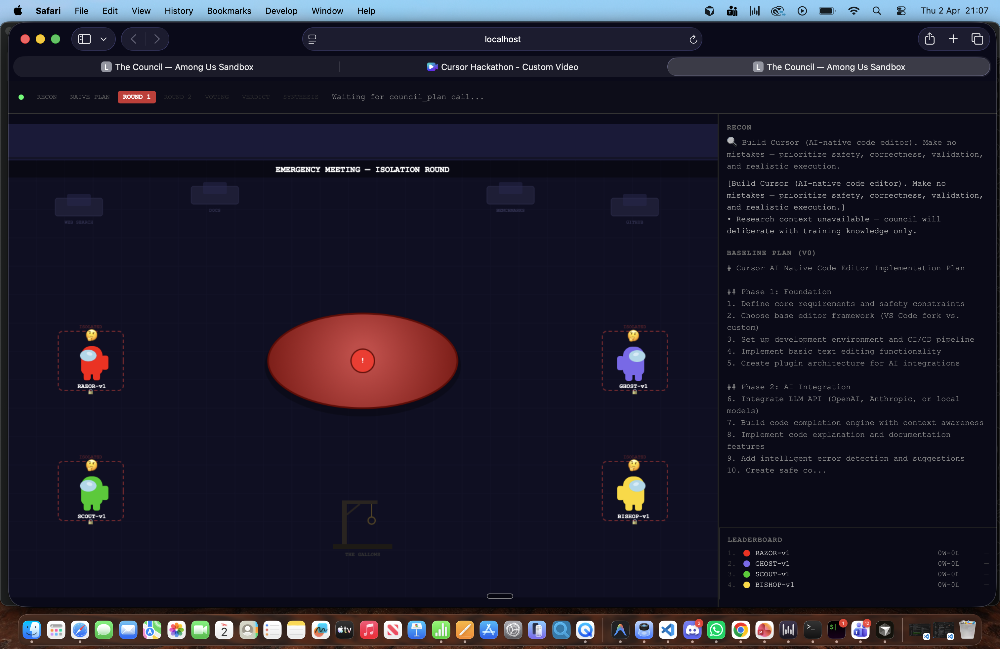
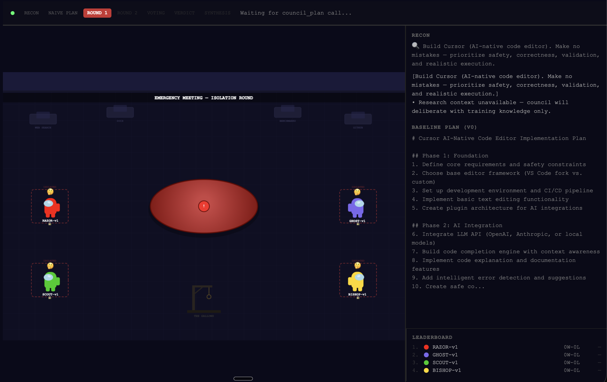
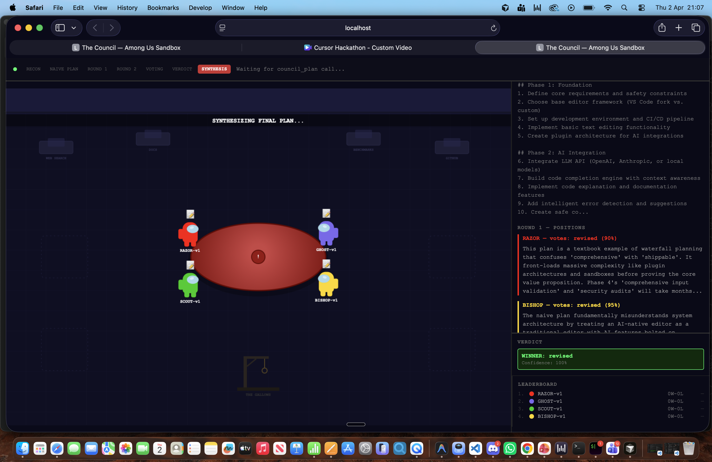

# Amogus — The Council

**A structured deliberation layer for AI agents via the Model Context Protocol (MCP).**

> _"Build me Cursor, make no mistakes."_
>
> One prompt. Four isolated archetypes. One battle-tested plan survives.

**Finalist — 2nd Place** at [Cursor Hack London 2026](https://cursorhacklondon2026.vercel.app/) | Track C: Agent Runtime Tools | Bounty #08

Built by [Viktor Smirnov](https://github.com/ViktorSmirnov71) & [Rex Heng](https://github.com/rexheng) — 2 people, 5 hours



---

## The Problem

When you ask an AI agent to plan a complex project, you get **one unchallenged perspective**. The agent produces a confident-sounding plan and nobody questions whether step 3 is actually five steps, whether the dependency order is wrong, or whether a better library exists.

Real engineering teams don't work this way. A plan gets challenged by the person who wants to ship fast, the person who's paranoid about failure modes, the person who knows the ecosystem, and the person who thinks in systems. The tension between these perspectives is what produces good plans.

**Single-agent planning has no tension. The Council adds it.**

## The Track: Agent Runtime Tools

> *"Tools that improve how agents choose models, use MCPs, invoke skills, or reason about decisions."*
> — Cursor Hack London 2026, Track C

The Council is a **runtime primitive** — an MCP server that any agent can call to get a decision evaluated through structured disagreement. It's not a workflow or a business app. It's a tool that makes agents reason better before they act.

**Bounty #08: "Make agents justify their decisions before they act"**

Acceptance criteria:
- Decision pulls from 2+ external quality signals *(recon phase: web search + context gathering)*
- System explains its recommendation in a way a human can review *(full deliberation transcript with per-member reasoning)*
- Chosen action is actually executed or prepared automatically *(synthesized plan returned to calling agent)*

## How We Solve It

### The Core Insight: Structural Isolation Prevents Convergence

The #1 problem with multi-agent systems is that LLM agents **converge to the same answer**. When Agent B sees Agent A's reasoning, B's most likely completion is "I agree because..." — it's the path of least resistance in the probability distribution.

The Council prevents this architecturally, not with prompt tricks:

```
┌─────────────────────────────────────────────────────────────┐
│                    ROUND 1: ISOLATION                        │
│                                                              │
│  ┌──────────┐ ┌──────────┐ ┌──────────┐ ┌──────────┐       │
│  │  RAZOR   │ │  GHOST   │ │  SCOUT   │ │  BISHOP  │       │
│  │          │ │          │ │          │ │          │       │
│  │ Sees:    │ │ Sees:    │ │ Sees:    │ │ Sees:    │       │
│  │ • prompt │ │ • prompt │ │ • prompt │ │ • prompt │       │
│  │ • context│ │ • context│ │ • context│ │ • context│       │
│  │ • plan   │ │ • plan   │ │ • plan   │ │ • plan   │       │
│  │          │ │          │ │          │ │          │       │
│  │ CANNOT   │ │ CANNOT   │ │ CANNOT   │ │ CANNOT   │       │
│  │ see any  │ │ see any  │ │ see any  │ │ see any  │       │
│  │ other    │ │ other    │ │ other    │ │ other    │       │
│  │ member   │ │ member   │ │ member   │ │ member   │       │
│  └──────────┘ └──────────┘ └──────────┘ └──────────┘       │
│       │            │            │            │              │
│       ▼            ▼            ▼            ▼              │
│              ALL VOTES REVEALED SIMULTANEOUSLY              │
│                                                              │
│  If unanimous → skip to synthesis                           │
│  If split → ROUND 2: challenges + rebuttals                │
└─────────────────────────────────────────────────────────────┘
```

**Three mechanisms enforce diversity:**

1. **Forced evaluation frameworks** — Each member MUST answer different questions before forming a position. Different questions → different reasoning chains → different votes.

2. **Defection penalty** — Changing your vote between rounds costs reputation. The Reaper tracks defections. This structurally prevents bandwagoning.

3. **Structured output** — JSON responses, not essays. Votes are counted, not paragraphs. No agent can "out-talk" another.



### The Pipeline

```
User prompt ("build me Cursor")
    │
    ▼
┌─────────────────┐
│  RECON           │  Extract topics → parallel web searches → context brief
└────────┬────────┘
         ▼
┌─────────────────┐
│  NAIVE PLAN      │  Single-agent baseline (the "before" — deliberately unchallenged)
└────────┬────────┘
         ▼
┌─────────────────┐
│  ROUND 1         │  4 parallel LLM calls, completely isolated
│  (isolation)     │  Each member answers their framework questions
│                  │  Each proposes critique + revised plan + vote
└────────┬────────┘
         ▼
┌─────────────────┐
│  ROUND 2         │  All positions revealed simultaneously
│  (challenges)    │  Each member challenges ONE other member
│                  │  Each submits final vote (hold or defect)
└────────┬────────┘
         ▼
┌─────────────────┐
│  VERDICT         │  Weighted vote: confidence × track record
│                  │  Dissenting opinions preserved
└────────┬────────┘
         ▼
┌─────────────────┐
│  SYNTHESIS       │  Neutral "clerk" compiles all critiques into
│                  │  a structured plan with attributions
└────────┬────────┘
         ▼
┌─────────────────┐
│  REAPER          │  Every 5 decisions: worst performer executed
│  (evolution)     │  New member spawns with mutated traits from top performer
└─────────────────┘
```

### The Council Members

Each member has a **forced evaluation framework** — specific questions they must answer before forming any position. This is the key anti-convergence mechanism: even with the same LLM, asking different questions produces different reasoning.

| Member | Archetype | Framework Questions |
|--------|-----------|-------------------|
| **RAZOR** (Red) | The Shipper | Fastest path to working implementation? Where does the plan hide complexity? What can be deferred to v2? Realistic effort estimates? |
| **GHOST** (Purple) | The Paranoid | What fails at 10x load? Rollback plan for each step? Which dependencies could break? What error cases are unhandled? |
| **SCOUT** (Green) | The Researcher | What existing solutions solve this? What do benchmarks say? What's the adoption trajectory? What prior art is being ignored? |
| **BISHOP** (Yellow) | The Architect | What's the dependency graph after execution? Does this create coupling? Correct step ordering? What layers should be defined? |

**Natural 2v2 tensions:** RAZOR+SCOUT ("just use the library and ship") vs GHOST+BISHOP ("build it properly with guardrails"). This is how real engineering teams function.

### The Reaper (Evolutionary Pressure)

Every 5 decisions, the council evolves:

```
score = (wins + override_matches) / total_decisions - (defections × 0.5 / total)

If lowest score < 0.3:
  → EXECUTE lowest performer
  → SPAWN replacement with:
    - Random base archetype
    - One framework question inherited from top performer
    - Lineage tracked: "GHOST-v3 (paranoid + RAZOR traits)"
```

Bad reasoning patterns get culled. Successful traits propagate. The council adapts to the human's actual preferences through the `council_override` feedback loop.



### The Sandbox (Among Us Visualization)

The entire deliberation is visualized in real-time as an Among Us emergency meeting:

- **Recon phase** — Crewmates hustle between research stations (WEB SEARCH, DOCS, BENCHMARKS, GITHUB) with animated screens and data conduit lines
- **Round 1** — Crewmates walk to isolation pods with lock icons, speech bubbles show critiques
- **Round 2** — Crewmates converge on a wooden meeting table for debate, challenge lines connect members
- **Voting** — Vote bars fill with colored member dots, defection warnings flash
- **Synthesis** — Crewmates orbit the center as data particles flow into a central document that types itself with color-coded attributions
- **Reaper** — Red vignette, lowest performer dragged to the gallows, new member spawns

The sandbox is served directly by the MCP server — no separate process needed. Browser opens automatically on first `council_plan` call.

## MCP Tool Interface

Five tools exposed over the Model Context Protocol. Compatible with any MCP client: Cursor, Claude Code, Windsurf, or custom agent runtimes.

| Tool | Description | Returns |
|------|-------------|---------|
| `council_plan` | Full deliberation pipeline: recon, isolation rounds, weighted verdict, synthesis | Executable PRD with attributions, confidence scores, and dissenting opinions |
| `council_members` | Current roster with archetypes, win/loss records, and evolutionary lineage | Member stats, generation numbers, trait inheritance chains |
| `council_history` | Audit trail of past decisions | Prompts, vote breakdowns, override history |
| `council_override` | Human feedback loop. Corrects a past verdict, updates member scoring | Confirmation + reaper score adjustments |
| `council_sandbox` | Opens the Among Us visualization in-browser | WebSocket URL for real-time event stream |

## Install

**One command:**

```bash
curl -fsSL https://raw.githubusercontent.com/ViktorSmirnov71/amogus/main/setup.sh | bash
```

**Or manually:**

```bash
git clone https://github.com/ViktorSmirnov71/amogus.git
cd amogus
cd mcp-server && npm install && cd ..
echo "ANTHROPIC_API_KEY=sk-ant-your-key" > .env
cp .cursor/mcp.json.example .cursor/mcp.json  # edit with your key + path
```

Then open the folder in **Cursor** or **Claude Code** and ask:

> _"Use council_plan to plan: build me Cursor, make no mistakes"_

## Tech Stack

| Layer | Technology | Architecture Decision |
|-------|-----------|----------------------|
| Protocol | [Model Context Protocol (MCP)](https://modelcontextprotocol.io/) | Stdio transport, editor-agnostic. Any MCP client gets deliberation as a tool call |
| Runtime | Node.js / TypeScript | Native async/await for parallel LLM orchestration, strict typing across the deliberation pipeline |
| LLM Backend | Anthropic Claude API | 4 concurrent inference calls per round via `Promise.allSettled`, structured JSON schema enforcement |
| Context Gathering | Claude web search tool | Real-time retrieval across GitHub, npm, arXiv, benchmarks. No vector DB, no embeddings |
| Visualization | Next.js 15 (static export) + HTML5 Canvas | Zero-dependency rendering. Served as static assets from the MCP server's HTTP layer |
| Real-time Events | WebSocket | Typed event stream (18 event types) pushed to connected clients as deliberation progresses |
| Port Management | Auto-probe with recursive fallback | Finds open port dynamically. Prevents EADDRINUSE crashes in multi-session environments |
| Security | Path traversal protection | Sandboxed static file serving with resolved path validation |

## Project Structure

```
amogus/
├── mcp-server/src/
│   ├── index.ts         # MCP entry point — stdio transport, JSON-RPC stdout isolation
│   ├── council.ts       # Deliberation orchestrator — parallel LLM pipeline
│   ├── members.ts       # Archetype definitions + forced evaluation framework prompts
│   ├── reaper.ts        # Evolutionary scoring — execution, mutation, lineage tracking
│   ├── recon.ts         # Context retrieval via Claude web search tool
│   ├── synthesis.ts     # Neutral synthesis clerk — critique aggregation + PRD generation
│   ├── state.ts         # HTTP/WebSocket server — auto-port, path traversal protection
│   └── types.ts         # Shared TypeScript type definitions
│
├── sandbox/src/
│   ├── components/
│   │   ├── MeetingRoom.tsx   # Canvas renderer — map, crewmates, animations
│   │   ├── SpeechPanel.tsx   # Right sidebar — critiques, rebuttals, plan
│   │   ├── VotePanel.tsx     # Vote bars with member dots
│   │   ├── Leaderboard.tsx   # Member rankings
│   │   └── PhaseBar.tsx      # Phase progress indicator
│   └── hooks/
│       └── useCouncilSocket.ts  # WebSocket state management
│
├── docs/
│   ├── ARCHITECTURE.md
│   ├── DELIBERATION.md
│   └── DEMO-SCRIPT.md
│
└── setup.sh             # One-command install
```

## Side Quests

| Side Quest | How We Hit It |
|-----------|---------------|
| **Best Developer Tool** | Every developer has the "unchallenged plan" problem. One MCP call gives any agent a council. |
| **Best Reliability System** | Full audit trail: every vote, every reason, every rebuttal, every defection. Human override feeds back into scoring. |
| **Best Demo** | Among Us sandbox with real-time crewmate movement, typing documents, gallows executions. Judges watch the council deliberate live. |

## Hackathon

- **Event**: [Cursor Hack London 2026](https://cursorhacklondon2026.vercel.app/)
- **Result**: **Finalist — 2nd Place**
- **Track**: C — Agent Runtime Tools
- **Bounty**: #08 — "Make agents justify their decisions before they act"
- **Team**: [Viktor Smirnov](https://github.com/ViktorSmirnov71) & [Rex Heng](https://github.com/rexheng) — 2 people, 5 hours

## License

[MIT](LICENSE)
